# MAPF with Edge Bundles
MAPF for Kinodynamic Systems using Edge Bundles 

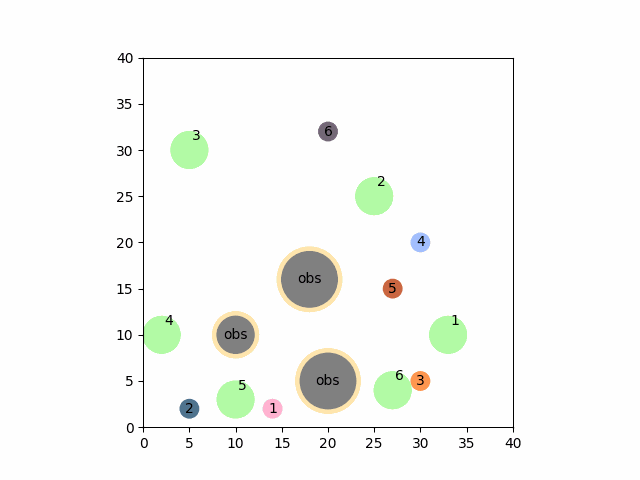

## MAPF, K-CBS, and Edge Bundles: Backround

### What is MAPF?

**M**ulti-**A**gent **P**ath **F**inding, or MAPF, refers to the general problem of moving multiple agents from unique starts to unique goals across an environment without colliding with each other or any obstacles that may also be present in the environment. A lot of work has been done in discrete spaces, where the agents move across a grid from discrete point to discrete point for example instead of behaving like real-world, continuous agents[^1]. However, these methods can be quite powerful and could, with some modification, prove very useful to the continuous-space problem as well. 

### What is K-CBS?

**C**onflict-**B**ased **S**each, or CBS, is such a discrete-space MAPF algorithm. A 'low-level' single-agent planner (like A*) finds a path for each agent across the environment independently of the other agents in the environment. CBS, the 'high-level' planner then inspects each of theses paths and identifies conflicts, which in the discrete case would be two points agents (agents _a_ and _b_) at the same gridspace at the same time, then imposes _constraints_ on the low-level planners for _a_ and _b_. A new node and an associated cost is added in a tree structure for each of these constrains, one specifying that the low-level planner for _a_ cannot place that agent at the conflict point at the conflict time and the other specifying the same for the low-level planner of _b_. Similar constraints and therefore tree nodes are added for all such inter-agent conflicts. CBS then selects the node from that tree structure with the lowest associated cost and the low-level planners for each agent once again plan individual paths through the environment, but this time respecting any constraints placed upon them. This cycle of added constraints and replanning repeats until a set of conflict-free paths for all agents is found. 

Kottinger et. al. propose a modification of CBS for continuous, kinodynamic agents they termed Kinodynamic-CBS or K-CBS[^2]. In K-CBS, the low-level planners are continuous, such as RRT, and what we call 'conflict blocks,' or ranges of states and times over which two agents collide are detected instead of discrete conflicts at a single point at a single time. When a continuous low-level planner under a constraint from such a conflict block is replanning, it must must ensure that its agent will not be in a state to conflict with the other involved agent at any of those times and at any of those states. As proposed in the K-CBS paper, each low-level planner will replan its path from scratch when respecting these new constraints. 

### What is pRRT?
Priority-RRT (pRRT) is a naive approach to the MAPF problem. Agents are assigned a unique priority. First, RRT is used to plan a path for the highest-priority agent. Next, the second-highest-priority agent uses RRT to plan a path, using the path for the highest-priority agent as a moving obstacle. This continues until all agents have a collision-free path.  


### What is cRRT?
Centralized-RRT (cRRT) plans for each agent concurrently. Unlike pRRT, each agent is treated with equal priority and planned with a joint 'superstate' (i.e. a vector that contains position data for each agent together) of each agent's position, the path to that position, etc. At each planning step, a randomly-generated superstate is compared to the superstates already in the tree and the nearest is selected. At this point, a new trajectory is calculated for each of the agents and if these trajectories are all valid and do not result in collisions the resulting superstate is added to the tree. Planning terminates when a superstate is found at which all agents are in their goal states.  

### What are Edge Bundles?

<figure>
  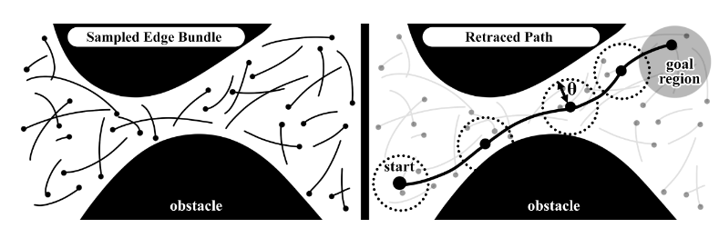
  <figcaption>Type 1 Edge Bundle illustration from [3]</figcaption>
</figure>

\
Edge bundles are pre-computed trajectories for a particular agent. Shome and Kavraki showed edge bundles to effectively increase the performance path finding for single-agent kinodynamic systems[^3]. Their planner pieced together a path through an environment crosshatched with edges by translating those edges carefully into a path. We refer to these as 'type-1 edge bundles.' We currently use a somewhat different approach to kinodynamic planning with edge bundles, but one that is in the same spirit. 

<figure>
  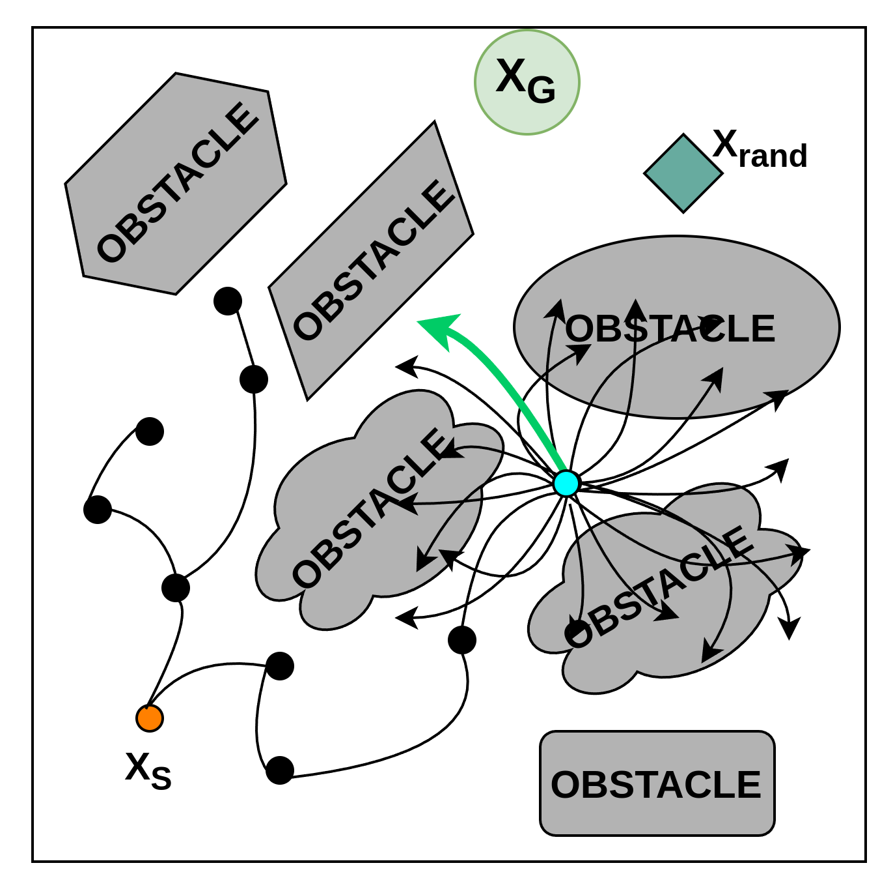
  <figcaption>Type 2 Edge Bundle illustration</figcaption>
</figure>

\
Our edges, which we call 'type-2 edge bundles,' all propagate from a single point instead of being spread throughout the environment. By translating the end states from those edges relative to the agent state we are propagating from, we can gather which actions and action durations will move the agent's path closest to a particular goal. In the sketch above, when propagating from the teal point with the bundle of edges (arrows), we know which actions will not lead to a collision and a particular action that will move the agent closest to a target, in this case the aquamarine diamond. 

These 'type 2' edges suit themselves well to mobile robots, but do not scale well to end effector applications where every state is highly dependent on those that come before it. 'Type 1' edge bundles, however, show some promise, as they are anchored to specific locations in the state space. 

## Our Approach 

By applying our edge bundle concept to RRT as the low-level single-agent planner in K-CBS, we will be able to improve on K-CBS as presented in the original paper. Not only will we be able to reap the performance benefits of Edge-Bundle RRT vs classical RRT as used in the K-CBS work during single agent planning, we will be able to streamline the replanning process of K-CBS. Instead of requiring each low-level planner to replan the agent's path from scratch when navigating a constraint, we will have a discretized in a way path with distinct points to go back to and replan from. If an agent's RRT planner, after propagating the agent over _x_ edges from its bundle, was found to have placed that agent in conflict with another agent while propagating over edge _x_+1, can simply go back to the state after _x_ edges (or an earlier edge if necessary) and pick a different edge from there to respect the constraint. We hope to show that this improvement, which we call 'rewiring,' will result in significant gains over using edge bundles alone. 

<figure>
  <table style="width: 900px;">
  <tbody>
  <tr>
  <td style="width: 300px;">&nbsp;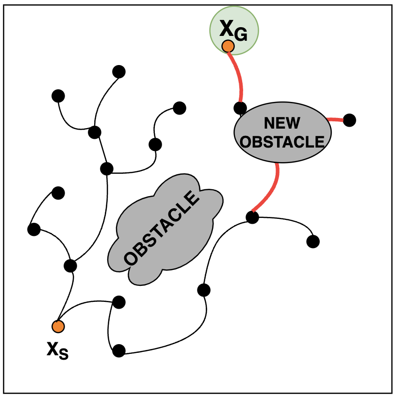</td>
  <td style="width: 300px;">&nbsp;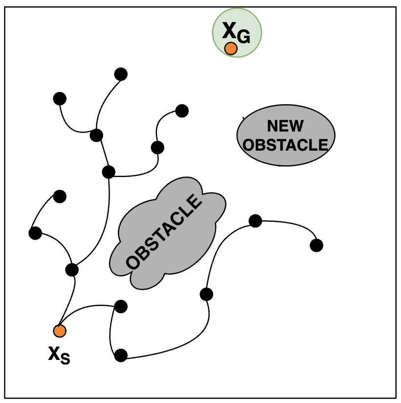</td>
  <td style="width: 300px;">&nbsp;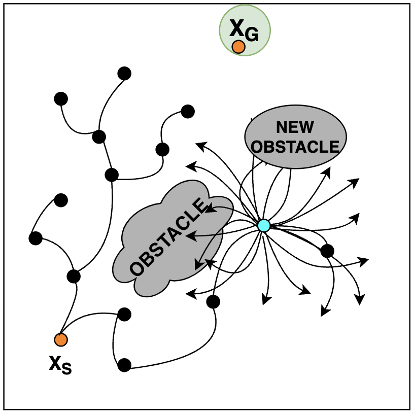</td>
  </tr>
  <tr>
  <td style="width: 300px;">Collision detected along path, new constraint/obstacle added</td>
  <td style="width: 300px;">Path truncated from collision edge on, rest of tree unaffected</td>
  <td style="width: 300px;">Planning starts from truncated tree in the next iteration</td>
  </tr>
  </tbody>
  </table>
  <figcaption>Rewiring: Instead of removing the entire tree after a collision is detected, only remove the edges after and including the collision and replan from there, with a constraint on the affected region at the time of the collision. Each small black circle along the path represents the start/end of an edge, which gives a convenient boundary for rewiring</figcaption>
</figure>

\
We also hope to show that edge bundles in general improve MAPF. We have applied edge bundles to Priority-RRT (pRRT) and Centralized-RRT (cRRT) as well and hope that in many cases these planners also show an improvement over the non-edge bundle versions. In particular, we believe that cRRT may be especially improved, as selection of diverging edges for agents in close proximity at every step may prevent collisions at the current or subsequent steps.  

[^1]: https://doi.org/10.48550/arXiv.1906.08291
[^2]: https://ieeexplore.ieee.org/document/9982018
[^3]: https://ieeexplore-ieee-org.colorado.idm.oclc.org/abstract/document/9560836

# Progress Report, Status, and Next Steps August 2025

At the beginning of the summer, we were somewhat befuddled with the lack of performance demonstrated by K-CBS against other methods, particularly pRRT. At this point, we were hoping to show K-CBS as a superior planner to p- and cRRT with or without edge bundles. We postulated several reasons why this may be:

* pRRT was incorrectly implemented in some way that caused it to plan conflicting paths and therefore advantage it unfairly
* K-CBS was incorrectly implemented in some way that that caused it to do more work than necessary and therefore was at a disadvantage
* K-CBS was not as strong as we believed it to be. 

### Is pRRT correct?
In an attempt to verify pRRT's correctness, we added a step in the test pipelines to pass the final paths through our code for collision checking in K-CBS, which we believed to be very rigorous. It did indeed have an issue, which we referred to as the 'pRRT tails error:'

<table style="width: 900px;">
<tbody>
<tr>
<td style="width: 300px;">&nbsp;</td>
<td style="width: 300px;">&nbsp;</td>
<td style="width: 300px;">&nbsp;</td>
</tr>
<tr>
<td style="width: 300px;">&nbsp;Agent 0 Plans Through Agent 1 Goal, t=m</td>
<td style="width: 300px;">Agent 1 Plans To Goal at t=n&lt;m</td>
<td style="width: 300px;">Collision at n &lt; t &lt; m</td>
</tr>
</tbody>
</table>

In our initial implementation, if a higher-priority agent (lower-number priority, above agent 0) plans through a lower-priority agent's (higher-number priority, above agent 1) goal at some time _m_, then that lower-priority agent plans to its goal reaching its goal at time _n<m_, planning for the lower-priority agent would stop: the agent had reached its goal. However, it would not take into account that, if the agent was at rest in its goal state at time _m_, the higher-priority agent would collide with it. 

We solved this problem by having the lower-priority planner check any previously-planned agents against its agent's goal state when found. This involves propagating the higher-priority agents (as moving obstacles) through their paths from _t=n_ to their respective goal states (see the initial implementation of this fix [here](https://github.com/himanshugupta1009/mrmp_with_kite_extend/commit/327c26eb726bd992d28fe9817ea1787decceefb1)). If a collision is detected, the current lower-priority agent's state is rejected and not added to the state tree. This did slow down pRRT solutions in some cases and in a handful of trials prevented pRRT from finding any solution at all. 

After fixing a floating point error in the way paths were returned from our planners, this fix did result in pRRT solutions passing the K-CBS collision detection machinery successfully in every case. However, it was still faster and more successful than K-CBS. We are not sure this is the best solution to this problem, but the literature on pRRT--as a somewhat naive solution--is unfortunately sparse and no better solution has been found. 

Our pRRT implementation benefits from the same performance improvements afforded by pre-compilation as K-CBS as described below, see [these](https://github.com/himanshugupta1009/mrmp_with_kite_extend/commit/8f3ea7f0fb4a1243a819fb70af149e02a8f9a46a) [commits](https://github.com/himanshugupta1009/mrmp_with_kite_extend/commit/29cd48312349ba509548904f6b7422175de4aac0). 

### Is K-CBS accurate?
Initially, after examining the algorithm for K-CBS and other CBS implementations, we discovered that we were adding far more constraints than necessary to each agent in K-CBS (see [this commit](https://github.com/himanshugupta1009/mrmp_with_kite_extend/commit/a2cc82190559413a36f960f5379f6952bcdf4f3c)). However, remedying this did not result in much improvement. We next attempted to re-create the trials reported in the original K-CBS paper[^2]. If we could replicate the results, that would indicate that our implementations for pRRT and K-CBS were correct. 

We modified our code to work with rectangular obstacles as well as the circular obstacles we had been using up to that point (see [this commit](https://github.com/himanshugupta1009/mrmp_with_kite_extend/commit/a7a66b05149f6e2a57c6afbbe85ee6220e381fad)) along with creating an agent class for the second order car agent used by the authors (see [this commit](https://github.com/himanshugupta1009/mrmp_with_kite_extend/commit/4ef9cc85aaf60a24481cf9c18ddcc6393eb14dbf)). In initial trials, we found that pRRT (even after the fix mentioned above) was more successful than reported while also having lower computation times than reported (see the results section below). This discrepancy aside, K-CBS was underperforming as well in more complex environments, even when the simulation time was increased (see results from these initial experiments for the paper's [narrow](https://drive.google.com/drive/folders/16FES_53hGluOSGc2FWLtmv6lSo-yvSf4?usp=sharing), [open](https://drive.google.com/drive/folders/1pohMAOgG3-K7oXeM6XBvhxHy3gAVG4RH?usp=sharing), and [cluttered](https://drive.google.com/drive/folders/1TKahACFTKxFfHGBSfWtSf19-Z7JtwJG-?usp=sharing) environments, examples of each environment below in the results section).    


In an attempt to discover why K-CBS was still underperforming, we profiled each of our planners (see some initial profiling work [here](https://drive.google.com/drive/folders/1dvEzergDY9WK-zmiEXtrdomvUVxHYBWV?usp=sharing) on our random environment with our Unicycle agent). We realized that while the individual RRT calls for pRRT are more expensive (each agent must plan around the paths for any higher-priority agents), K-CBS was making more calls to RRT. This makes sense: in K-CBS, an initial plan is found for each agent (already as many RRT calls as pRRT would make) and at least one individual call is made for any conflicts found. We reasoned that if we could improve the speed of the underlying RRT planner K-CBS could improve. 

One function that stood out as particularly time-consuming was 'get_nearest_node,' the function that finds the node in the state tree that is closest to a randomly-selected point. After trialing many different solutions (see [this commit](https://github.com/himanshugupta1009/mrmp_with_kite_extend/commit/5bcb61131e4a2613faba99c3a86d16e9778d643a)), we eventually improved the performance of this function by using numba, a just-in-time compilation utility for python. We also improved the agent dynamics propagators and other utility functions as well as the conflict detection and rewiring mechanisms inside K-CBS with numba. 

### CRRT 
Most of this semester we were focused on pRRT and K-CBS, mainly due to the fact that cRRT was performing very poorly as compared to K-CBS and especially pRRT, which was doing unsettlingly well. However, once we pivoted from attempting to show K-CBS with edge bundles was superior to attempting to show that edge bundles can improve a variety of algorithms, we decided to bring it back and updated it for the new precompile-ready utility functions (see [this commit](https://github.com/himanshugupta1009/mrmp_with_kite_extend/commit/f8c5adf6e4e01c48a36a81874255799d12bdb736)).

An interesting finding from experiments with cRRT is that _not_ propagating a new trajectory for agents that had already reached their goal _decreased_ performance. We believe that this is an artifact of the 'get_nearest_node' function, which for cRRT returns the superstate closest to a random superstate. In our implementation, once an agent has found its goal state at some point in the state tree, the center point of its goal region is returned 70% of the time as its section of the random superstate instead of the RRT-standard 10% for agents that have not yet reached their goal state. This particular detail of our implementation was added as before its inclusion cRRT struggled to find any solution. Potentially, this biases the selection of the nearest node too much to towards a superstate containing the exact same goal state for a particular agent which--compounding as more and more agents reach their goal--limits exploration for agents which have not yet reached the goal state. This is only speculation for now and exploring the exact root cause of this, remedying it, then letting agents in their goal state stay stationary could improve computation time, agent path time, and path cost. 

At first, we did not plan on extending edge bundles to cRRT. As each edge has its own duration, each agent in the joint planning step would need to select an edge that took the exact same amount of time. However, we realized that the sort of dynamics models that are supported by 'type 2' edge bundles do not rely on the previous state (first-order models). Therefore, each agent could select an edge of any duration at each step then 'wait' in place while any other agents with longer duration edges completed their paths for that step. We [implemented this](https://github.com/himanshugupta1009/mrmp_with_kite_extend/commit/6641fabceeb40514db3991e417767bf6ff53518c) with results presented below. Currently, each agent selects an edge independently of the others before the resulting paths are checked for collisions, as in vanilla cRRT each agent picks an action independently. However, we hypothesize that edge selection for each agent could be informed by the edge selection each other agent makes during a particular step. Once every agent has selected an edge for a particular step, edges that move agents too close to eachother could be disallowed, similar to the constraints used by K-CBS. The affected agents would then be made to choose alternate edges that provide more separation. This improvement would leverage the unique properties of cRRT where each agent picks its next state concurrently, unlike pRRT or K-CBS. We have not yet implemented this strategy, but we believe it will improve the success rate for edge bundle cRRT. 

<figure>
  <table style="width: 800px;">
  <tbody>
  <tr>
  <td style="width: 400px;">&nbsp;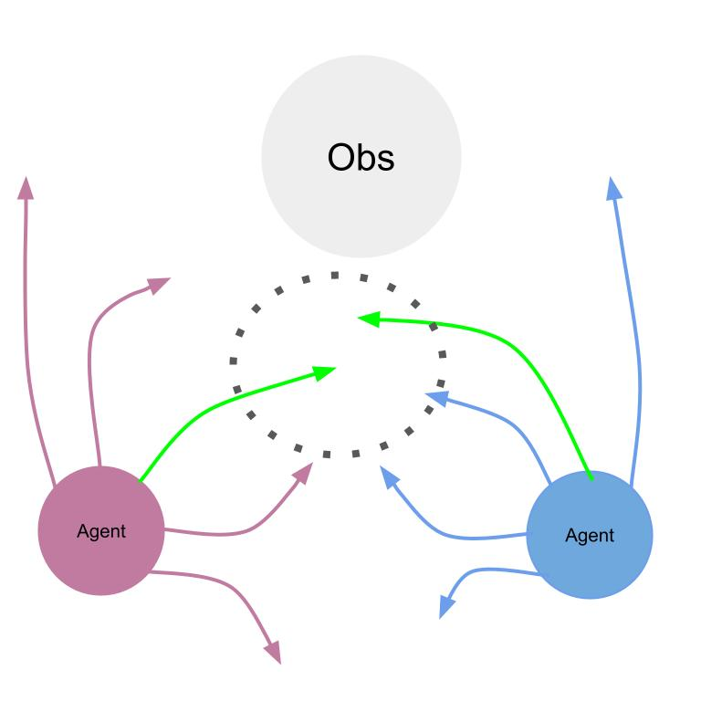</td>
  <td style="width: 400px;">&nbsp;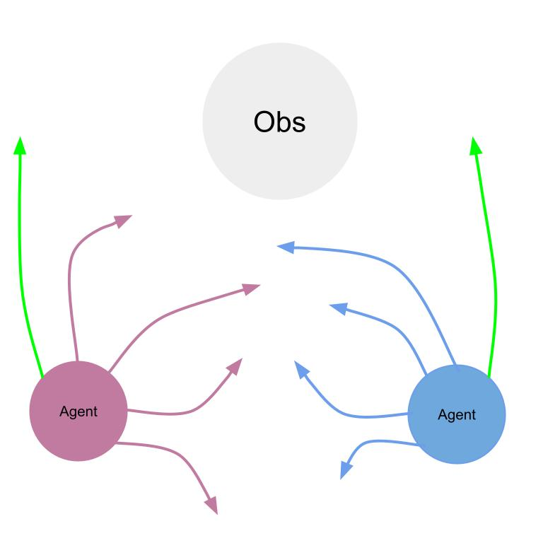</td>
  </tr>
  <tr>
  <td style="width: 400px;">Two agents select edges that would move them too close to eachother.</td>
  <td style="width: 400px;">Each agent affected selects an edge that will result in more separation.</td>
  </tr>
  </tbody>
  </table>
  <figcaption>When two agents select edges (shown in green) that would move them unacceptably close (i.e. the resulting states would both lie within some theta-ball) to eachother during edge bundle cRRT, they can be made to select edges that will result in states a greater distance apart.</figcaption>
</figure>

## Results 

### Edge Bundle Planner Experiments
To test methods with edge bundles against their counterparts that do not use edge bundles, we use an 40x40 unit randomly-generated 2-D environment. Each agent start state, agent goal region, and obstacle is placed randomly in the environment, subject to constraints to guarantee solvability. Each iteration of the test provides each planner with the same randomly-generated environment, a process which repeats for 50 iterations for each agent count. Planners are then given 300 seconds to compute a valid path. Results are gathered and compiled at the completion of this 50-iteration cycle. For this environment, all experiments were performed on a machine with a Ryzen 9 5900x running at 3.7 GHz with 32 GB of RAM. 

Each circular agent follows a "Unicycle" dynamics model. The state of each agent is defined as the three-tuple $(x, y, \theta)$, where $x$ represents the horizontal position of the agent, $y$ represents the vertical position of the agent, and $\theta$ represents the orientation angle of the agent. Control inputs are defined by the tuple $(v, \omega)$ where $v$ is the velocity of the agent in the direction of its orientation and $\omega$ is the rate of change in orientation. Therefore, the dynamics of the vehicle can be represented as 

$$x' = v\cos(\theta), \quad y' = v \sin(\theta), \quad \theta' = \theta \omega $$

Each agent is constrained to a max $v$ of 2 and max $\omega$ of $\pi / 2$ and has a radius of 1 unit. Cost is calculated based on the distance each agent travels along its solution.

<figure>
  <table style="width: 800px;">
  <tbody>
  <tr>
  <td style="width: 400px;">&nbsp;</td>
  <td style="width: 400px;">&nbsp;</td>
  </tr>
  </tbody>
  </table>
  <figcaption>PRRT solution to the environment with 4 agents.</figcaption>
</figure>

\
With the most recent versions of the planners, we ran each of Edge Bundle RRT K-CBS, RRT K-CBS, Edge Bundle PRRT, PRRT, Edge Bundle CRRT, and CRRT through environments comprising of 4, 5, 6, 7, and 10 agents. Success count, computation time, total cost among all agents, average path completion time among all agents, and max agent path time was recorded over every iteration. Each metric beyond success is only calculated on successful runs. 


<table style="width: 1000px;">
<tbody>
<tr>
<td style="width: 100px;"></td>
<td style="width: 180px;">4 Agents</td>
<td style="width: 180px;">5 Agents</td>
<td style="width: 180px;">6 Agents</td>
<td style="width: 180px;">7 Agents</td>
<td style="width: 180px;">10 Agents</td>
</tr>
<tr>
<td style="width: 100px;">Success Rate (%)</td>
<td style="width: 180px;"></td>
<td style="width: 180px;"></td>
<td style="width: 180px;"></td>
<td style="width: 180px;"></td>
<td style="width: 180px;"></td>
</tr>
<tr>
<td style="width: 100px;">Computation Time (s)</td>
<td style="width: 180px;"></td>
<td style="width: 180px;"></td>
<td style="width: 180px;"></td>
<td style="width: 180px;"></td>
<td style="width: 180px;"></td>
</tr>
<tr>
<td style="width: 100px;">Cost</td>
<td style="width: 180px;"></td>
<td style="width: 180px;"></td>
<td style="width: 180px;"></td>
<td style="width: 180px;"></td>
<td style="width: 180px;"></td>
</tr>
<tr>
<td style="width: 100px;">Average Path Time (s)</td>
<td style="width: 180px;"></td>
<td style="width: 180px;"></td>
<td style="width: 180px;"></td>
<td style="width: 180px;"></td>
<td style="width: 180px;"></td>
</tr>
<tr>
<td style="width: 100px;">Maximum Path Time (s)</td>
<td style="width: 180px;"></td>
<td style="width: 180px;"></td>
<td style="width: 180px;"></td>
<td style="width: 180px;"></td>
<td style="width: 180px;"></td>
</tr>
</tbody>
</table>
Edge Bundle RRT K-CBS in Blue, RRT K-CBS in Orange, Edge Bundle PRRT in Green, PRRT in Blue, Edge Bundle CRRT in Purple, and CRRT in Brown. 

\
The same results in table format, with the average of each metric beyond success listed with its Standard Error of the Mean. 
<table style="width: 1000px;">
<tbody>
<tr>
<td style="width: 100px;">4 Agents</td>
</tr>
<tr>
<td style="width: 100px;"></td>
<td style="width: 180px;">Success Rate (%)</td>
<td style="width: 180px;">Avg. Computation Time (s)</td>
<td style="width: 180px;">Avg. Cost</td>
<td style="width: 180px;">Avg. Average Agent Path Time (s)</td>
<td style="width: 180px;">Avg. Maximum Path Time</td>
</tr>
<tr>
<td style="width: 100px;">Edge Bundle RRT KCBS</td>
<td style="width: 180px;">100</td>
<td style="width: 180px;">0.293 &plusmn; 0.073</td>
<td style="width: 180px;">127.863 &plusmn; 3.039</td>
<td style="width: 180px;">27.785 &plusmn; 0.974</td>
<td style="width: 180px;">41.494 &plusmn; 1.915</td>
</tr>
<tr>
<tr>
<td style="width: 100px;">RRT KCBS</td>
<td style="width: 180px;">100</td>
<td style="width: 180px;">1.123 &plusmn; 0.192</td>
<td style="width: 180px;">163.069 &plusmn; 4.188</td>
<td style="width: 180px;">49.929 &plusmn; 1.665</td>
<td style="width: 180px;">71.210 &plusmn; 2.379</td>
</tr>

<tr>
<td style="width: 100px;">Edge Bundle PRRT</td>
<td style="width: 180px;">84</td>
<td style="width: 180px;">2.315 &plusmn; 15.699</td>
<td style="width: 180px;">149.764 &plusmn; 4.142</td>
<td style="width: 180px;">29.547 &plusmn; 0.883</td>
<td style="width: 180px;">44.529 &plusmn; 1.882</td>
</tr>

<tr>
<td style="width: 100px;">PRRT</td>
<td style="width: 180px;">86</td>
<td style="width: 180px;">5.976 &plusmn; 15.359</td>
<td style="width: 180px;">189.730 &plusmn; 6.353</td>
<td style="width: 180px;">52.445 &plusmn; 1.801</td>
<td style="width: 180px;">77.477 &plusmn; 3.598</td>
</tr>

<tr>
<td style="width: 100px;">Edge Bundle CRRT</td>
<td style="width: 180px;">100</td>
<td style="width: 180px;">0.271 &plusmn; 0.059</td>
<td style="width: 180px;">273.387 &plusmn; 9.509</td>
<td style="width: 180px;">79.858 &plusmn; 4.064</td>
<td style="width: 180px;">79.858 &plusmn; 4.064</td>
</tr>

<tr>
<td style="width: 100px;">CRRT</td>
<td style="width: 180px;">100</td>
<td style="width: 180px;">1.747 &plusmn; 0.221</td>
<td style="width: 180px;">446.997 &plusmn; 13.580</td>
<td style="width: 180px;">130.500 &plusmn; 3.978</td>
<td style="width: 180px;">130.500 &plusmn; 3.978</td>
</tr>
<tr>
<td style="width: 100px;">5 Agents</td>
</tr>
<tr>
<td style="width: 100px;"></td>
<td style="width: 180px;">Success Rate (%)</td>
<td style="width: 180px;">Avg. Computation Time (s)</td>
<td style="width: 180px;">Avg. Cost</td>
<td style="width: 180px;">Avg. Average Agent Path Time (s)</td>
<td style="width: 180px;">Avg. Maximum Path Time</td>
</tr>
<tr>
<td style="width: 100px;">Edge Bundle RRT KCBS</td>
<td style="width: 180px;">100</td>
<td style="width: 180px;">0.364 &plusmn; 0.088</td>
<td style="width: 180px;">147.944 &plusmn; 3.638</td>
<td style="width: 180px;">26.289 &plusmn; 1.231</td>
<td style="width: 180px;">38.034 &plusmn; 1.525</td>
</tr>

<tr>
<td style="width: 100px;">RRT KCBS</td>
<td style="width: 180px;">100</td>
<td style="width: 180px;">1.922 &plusmn; 0.479</td>
<td style="width: 180px;">192.202 &plusmn; 4.938</td>
<td style="width: 180px;">48.196 &plusmn; 1.768</td>
<td style="width: 180px;">69.108 &plusmn; 2.343</td>
</tr>

<tr>
<td style="width: 100px;">Edge Bundle PRRT</td>
<td style="width: 180px;">92</td>
<td style="width: 180px;">4.771 &plusmn; 11.708</td>
<td style="width: 180px;">183.862 &plusmn; 6.962</td>
<td style="width: 180px;">27.860 &plusmn; 1.199</td>
<td style="width: 180px;">43.478 &plusmn; 2.313</td>
</tr>

<tr>
<td style="width: 100px;">PRRT</td>
<td style="width: 180px;">90</td>
<td style="width: 180px;">7.590 &plusmn; 12.960</td>
<td style="width: 180px;">229.068 &plusmn; 7.838</td>
<td style="width: 180px;">48.846 &plusmn; 1.728</td>
<td style="width: 180px;">72.118 &plusmn; 3.139</td>
</tr>

<tr>
<td style="width: 100px;">Edge Bundle CRRT</td>
<td style="width: 180px;">100</td>
<td style="width: 180px;">0.296 &plusmn; 0.049</td>
<td style="width: 180px;">364.764 &plusmn; 13.408</td>
<td style="width: 180px;">76.662 &plusmn; 3.681</td>
<td style="width: 180px;">76.662 &plusmn; 3.681</td>
</tr>

<tr>
<td style="width: 100px;">CRRT</td>
<td style="width: 180px;">100</td>
<td style="width: 180px;">2.387 &plusmn; 0.272</td>
<td style="width: 180px;">602.669 &plusmn; 20.951</td>
<td style="width: 180px;">138.080 &plusmn; 4.823</td>
<td style="width: 180px;">138.080 &plusmn; 4.823</td>
</tr>
<tr>
<td style="width: 100px;">6 Agents</td>
</tr>
<tr>
<td style="width: 100px;"></td>
<td style="width: 180px;">Success Rate (%)</td>
<td style="width: 180px;">Avg. Computation Time (s)</td>
<td style="width: 180px;">Avg. Cost</td>
<td style="width: 180px;">Avg. Average Agent Path Time (s)</td>
<td style="width: 180px;">Avg. Maximum Path Time</td>
</tr>
<tr>
<td style="width: 100px;">Edge Bundle RRT KCBS</td>
<td style="width: 180px;">100</td>
<td style="width: 180px;">0.650 &plusmn; 0.295</td>
<td style="width: 180px;">185.013 &plusmn; 4.794</td>
<td style="width: 180px;">26.994 &plusmn; 0.962</td>
<td style="width: 180px;">40.760 &plusmn; 1.521</td>
</tr>

<tr>
<td style="width: 100px;">RRT KCBS</td>
<td style="width: 180px;">100</td>
<td style="width: 180px;">8.631 &plusmn; 3.202</td>
<td style="width: 180px;">233.459 &plusmn; 5.576</td>
<td style="width: 180px;">50.046 &plusmn; 1.605</td>
<td style="width: 180px;">74.280 &plusmn; 2.814</td>
</tr>

<tr>
<td style="width: 100px;">Edge Bundle PRRT</td>
<td style="width: 180px;">90</td>
<td style="width: 180px;">3.150 &plusmn; 13.013</td>
<td style="width: 180px;">223.598 &plusmn; 7.378</td>
<td style="width: 180px;">27.918 &plusmn; 0.977</td>
<td style="width: 180px;">44.013 &plusmn; 1.696</td>
</tr>

<tr>
<td style="width: 100px;">PRRT</td>
<td style="width: 180px;">84</td>
<td style="width: 180px;">8.758 &plusmn; 15.953</td>
<td style="width: 180px;">291.500 &plusmn; 9.307</td>
<td style="width: 180px;">52.054 &plusmn; 1.851</td>
<td style="width: 180px;">82.248 &plusmn; 4.068</td>
</tr>

<tr>
<td style="width: 100px;">Edge Bundle CRRT</td>
<td style="width: 180px;">100</td>
<td style="width: 180px;">0.854 &plusmn; 0.250</td>
<td style="width: 180px;">489.138 &plusmn; 19.288</td>
<td style="width: 180px;">87.850 &plusmn; 5.264</td>
<td style="width: 180px;">87.850 &plusmn; 5.264</td>
</tr>

<tr>
<td style="width: 100px;">CRRT</td>
<td style="width: 180px;">100</td>
<td style="width: 180px;">7.039 &plusmn; 1.192</td>
<td style="width: 180px;">872.355 &plusmn; 31.922</td>
<td style="width: 180px;">168.260 &plusmn; 6.552</td>
<td style="width: 180px;">168.260 &plusmn; 6.552</td>
</tr>
<tr>
<td style="width: 100px;">7 Agents</td>
</tr>
<tr>
<td style="width: 100px;"></td>
<td style="width: 180px;">Success Rate (%)</td>
<td style="width: 180px;">Avg. Computation Time (s)</td>
<td style="width: 180px;">Avg. Cost</td>
<td style="width: 180px;">Avg. Average Agent Path Time (s)</td>
<td style="width: 180px;">Avg. Maximum Path Time</td>
</tr>
<tr>
<td style="width: 100px;">Edge Bundle RRT KCBS</td>
<td style="width: 180px;">100</td>
<td style="width: 180px;">1.046 &plusmn; 0.146</td>
<td style="width: 180px;">208.036 &plusmn; 3.855</td>
<td style="width: 180px;">26.534 &plusmn; 0.695</td>
<td style="width: 180px;">42.502 &plusmn; 1.425</td>
</tr>

<tr>
<td style="width: 100px;">RRT KCBS</td>
<td style="width: 180px;">100</td>
<td style="width: 180px;">9.985 &plusmn; 2.884</td>
<td style="width: 180px;">261.557 &plusmn; 4.575</td>
<td style="width: 180px;">49.868 &plusmn; 1.353</td>
<td style="width: 180px;">77.528 &plusmn; 2.438</td>
</tr>

<tr>
<td style="width: 100px;">Edge Bundle PRRT</td>
<td style="width: 180px;">74</td>
<td style="width: 180px;">18.466 &plusmn; 18.309</td>
<td style="width: 180px;">269.189 &plusmn; 7.851</td>
<td style="width: 180px;">28.837 &plusmn; 0.877</td>
<td style="width: 180px;">47.449 &plusmn; 2.115</td>
</tr>

<tr>
<td style="width: 100px;">PRRT</td>
<td style="width: 180px;">78</td>
<td style="width: 180px;">9.895 &plusmn; 17.691</td>
<td style="width: 180px;">336.293 &plusmn; 9.461</td>
<td style="width: 180px;">50.988 &plusmn; 1.495</td>
<td style="width: 180px;">81.882 &plusmn; 4.707</td>
</tr>

<tr>
<td style="width: 100px;">Edge Bundle CRRT</td>
<td style="width: 180px;">100</td>
<td style="width: 180px;">1.069 &plusmn; 0.155</td>
<td style="width: 180px;">619.059 &plusmn; 20.719</td>
<td style="width: 180px;">98.490 &plusmn; 4.390</td>
<td style="width: 180px;">98.490 &plusmn; 4.390</td>
</tr>

<tr>
<td style="width: 100px;">CRRT</td>
<td style="width: 180px;">100</td>
<td style="width: 180px;">11.304 &plusmn; 1.725</td>
<td style="width: 180px;">1144.566 &plusmn; 33.364</td>
<td style="width: 180px;">187.560 &plusmn; 5.595</td>
<td style="width: 180px;">187.560 &plusmn; 5.595</td>
</tr>
<tr>
<td style="width: 100px;">10 Agents</td>
</tr>
<tr>
<td style="width: 100px;"></td>
<td style="width: 180px;">Success Rate (%)</td>
<td style="width: 180px;">Avg. Computation Time (s)</td>
<td style="width: 180px;">Avg. Cost</td>
<td style="width: 180px;">Avg. Average Agent Path Time (s)</td>
<td style="width: 180px;">Avg. Maximum Path Time</td>
</tr>
<tr>
<td style="width: 100px;">Edge Bundle RRT KCBS</td>
<td style="width: 180px;">100</td>
<td style="width: 180px;">18.584 &plusmn; 6.350</td>
<td style="width: 180px;">278.097 &plusmn; 3.178</td>
<td style="width: 180px;">26.939 &plusmn; 0.706</td>
<td style="width: 180px;">46.014 &plusmn; 1.494</td>
</tr>

<tr>
<td style="width: 100px;">RRT KCBS</td>
<td style="width: 180px;">92</td>
<td style="width: 180px;">38.231 &plusmn; 11.931</td>
<td style="width: 180px;">346.220 &plusmn; 4.352</td>
<td style="width: 180px;">49.886 &plusmn; 1.135</td>
<td style="width: 180px;">78.085 &plusmn; 2.400</td>
</tr>

<tr>
<td style="width: 100px;">Edge Bundle PRRT</td>
<td style="width: 180px;">72</td>
<td style="width: 180px;">18.554 &plusmn; 18.905</td>
<td style="width: 180px;">395.775 &plusmn; 9.440</td>
<td style="width: 180px;">28.808 &plusmn; 0.794</td>
<td style="width: 180px;">52.569 &plusmn; 1.906</td>
</tr>

<tr>
<td style="width: 100px;">PRRT</td>
<td style="width: 180px;">62</td>
<td style="width: 180px;">25.330 &plusmn; 20.254</td>
<td style="width: 180px;">519.532 &plusmn; 13.683</td>
<td style="width: 180px;">53.532 &plusmn; 1.456</td>
<td style="width: 180px;">96.029 &plusmn; 4.136</td>
</tr>

<tr>
<td style="width: 100px;">Edge Bundle CRRT</td>
<td style="width: 180px;">100</td>
<td style="width: 180px;">4.133 &plusmn; 0.958</td>
<td style="width: 180px;">1051.891 &plusmn; 29.014</td>
<td style="width: 180px;">117.066 &plusmn; 5.120</td>
<td style="width: 180px;">117.066 &plusmn; 5.120</td>
</tr>

<tr>
<td style="width: 100px;">CRRT</td>
<td style="width: 180px;">100</td>
<td style="width: 180px;">40.284 &plusmn; 3.912</td>
<td style="width: 180px;">1968.012 &plusmn; 44.110</td>
<td style="width: 180px;">227.600 &plusmn; 5.187</td>
<td style="width: 180px;">227.600 &plusmn; 5.187</td>
</tr>

</tbody>
</table>

Note that the average and max path time figures are always the same for cRRT. This is expected: as cRRT planning completes when a superstate containing a goal state for _each_ agent is achieved, each agent's path time to that state is equal (even if no motion occurs for any duration of that time).


Overall, these results seem to be heading in the right direction. For K-CBS and cRRT, each of the edge bundle variants was able to compute a higher quality path than the 'normal' variant in less time and with a lower cost. Their success rates in these trials are also impressive (especially for cRRT, a theoretically very inefficient planner).


However, pRRT is performing in an unexpected way. Before this latest round of experiments, pRRT was consistently improved by using edge bundles and the edge bundle pRRT had very high success rates even as agent counts increased. This phenomenon needs to be further explored.


### Replication of the K-CBS Paper Experiments
Much of our time this semester was spent attempting to replicate the experimental environments from the original K-CBS paper[^2]. Therefore, I will report on those results as well.


The authors of that paper have a publicly-available implementation of their [implementation](https://github.com/aria-systems-group/Multi-Robot-OMPL/tree/e51b5c729ba5bbbbd4d0f6cb10575bdc6cda69d4) and some of their [experimental setup](https://github.com/aria-systems-group/K-CBS-Demos) in C++, which we used as a reference to design our environments in python. However, it is important to note that more work has been done on K-CBS since the original paper was published, and though there are multiple branches and commits one browse in these repositories to attempt to track down the version of the planner and experiment environments used in the original paper, the names of these branches and commits are not always clear and when they are do not always seem to match those reported in the paper.


As in the experiments performed for our environment above, each iteration of the test provides each planner with the same randomly-generated environment, a process which repeats for 50 iterations for each agent count. Results are gathered and compiled at the completion of this 50-iteration cycle. Planners are given 300 seconds to compute a valid path for each iteration, just as in the paper. However, the authors of the K-CBS paper computed their figures using 100 instances. For these environments, all experiments were penames of these branches and commits are not always clear and when they are do not always seem to match those reported in the paper.


As in the expirements performed for our environment above, each iteration of the test provides each planner with the same randomly-generated environment, a process which repeats for 50 iterations for each agent count. Results are gathered and compiled at the completion of this 50-iteration cycle. Planners are given 300 seconds to compute a valid path for each iteration, just as in the paper. However, the authors of the K-CBS paper computed their figures using 100 instances. For these environments, all experiments were performed on a server with two Intel Xeon Gold 5220R CPUs running at 2.20GHz with 125 GB of RAM. As each experiment was run sequentially within itself (i.e. each test class is run sequentially within the pipeline, though multiple pipelines were executed simultaneously), the increased thread count was not a performance upgrade to the desktop mentioned for the edge bundle experiments. RAM usage was never observed to exceed 1 GB.

Each agent in the experiments from the paper and therefore in our recreations follow a Second-Order Car model, where the state is a 5-tuple of $(x, y, \theta, v, \phi)$, with $x$ as the horizontal positon, $y$ as the vertical position, $\theta$ as the orientation, $v$ as the current velocity, and $\phi$ as the current steering angle. Control inputs are defined as a vector $u$, where $u_1$ is the acceleration and $u_2$ is the rate of change of the steering angle $\phi$. Therefore, the dynamics of the agent can be represented as

$$x' = v\cos(\theta), \quad y' = v \sin(\theta), \quad \theta' = \frac{v}{l} \tan \phi, \quad v' = u_1, \quad \phi' = u_2$$

where $l$ is the wheelbase. Unlike the paper, our agents are circular with a radius of 0.6 units (as opposed to the paper, which uses rectangular agents with 0.7 unit length and 0.5 unit width). We still use $l=0.7$, which we believe the authors of the original paper used as well. Like the agents from the paper, we limit $u_1$ to $\pm 1$, $u_2$ to $\pm 0.5$ and $\phi$ to $\pm \pi / 3$.

As this model is second-order, the edge bundle variants of the planners cannot be used. This is just as well, as the goal of these experiments was to replicate those from the original K-CBS paper which did not use edge bundles. For most of these experiments, we tested K-CBS, pRRT, and cRRT. However, in the Large Env., we only tested K-CBS and pRRT for higher agent counts, discarding cRRT due to poor performance.

As a final note, we discovered that an optimization for the cRRT planner that works for first-order systems results in invalid path results for higher-order agents. Therefore, we did not include cRRT in our tests with the environments from the K-CBS paper. Remember from above, however, that our impetus to recreate these environments was that pRRT was performing too favorably against K-CBS, the results from both we are confident in. 

#### Open Environment 

In the open environment, agents are lined up opposing eachother across a 10x10 environment with no obstacles. Each agent's start and goal state is fixed (i.e. does not change iteration to iteration). As additional agents are added, additional hard-coded starts and goals are added as well. However, seeds are different for each run. 

<figure>
  <table style="width: 800px;">
  <tbody>
  <tr>
  <td style="width: 400px;">&nbsp;</td>
  <td style="width: 400px;">&nbsp;</td>
  </tr>
  </tbody>
  </table>
  <figcaption>PRRT solution to the 'open' environment with 6 agents.</figcaption>
</figure>

\
We ran each of pRRT and K-CBS with environments containing 2-5 agents. Success count, computation time, total cost among all agents, average path completion time among all agents, and max agent path time was recorded over every iteration. Each metric beyond success is only calculated on successful runs.

<table style="width: 1000px;">
<tbody>
<tr>
<td style="width: 100px;"></td>
<td style="width: 180px;">2 Agents</td>
<td style="width: 180px;">3 Agents</td>
<td style="width: 180px;">4 Agents</td>
<td style="width: 180px;">5 Agents</td>
<td style="width: 180px;">6 Agents</td>
</tr>
<tr>
<td style="width: 100px;">Success Rate (%)</td>
<td style="width: 180px;"></td>
<td style="width: 180px;"></td>
<td style="width: 180px;"></td>
<td style="width: 180px;"></td>
<td style="width: 180px;"></td>
</tr>
<tr>
<td style="width: 100px;">Computation Time (s)</td>
<td style="width: 180px;"></td>
<td style="width: 180px;"></td>
<td style="width: 180px;"></td>
<td style="width: 180px;"></td>
<td style="width: 180px;"></td>
</tr>
<tr>
<td style="width: 100px;">Cost</td>
<td style="width: 180px;"></td>
<td style="width: 180px;"></td>
<td style="width: 180px;"></td>
<td style="width: 180px;"></td>
<td style="width: 180px;"></td>
</tr>
<tr>
<td style="width: 100px;">Average Path Time (s)</td>
<td style="width: 180px;"></td>
<td style="width: 180px;"></td>
<td style="width: 180px;"></td>
<td style="width: 180px;"></td>
<td style="width: 180px;"></td>
</tr>
<tr>
<td style="width: 100px;">Maximum Path Time (s)</td>
<td style="width: 180px;"></td>
<td style="width: 180px;"></td>
<td style="width: 180px;"></td>
<td style="width: 180px;"></td>
<td style="width: 180px;"></td>
</tr>
</tbody>
</table>
PRRT in Blue and RRT K-CBS in Orange. 

\
The same results in table format, with the average of each metric beyond success listed with its Standard Error of the Mean. 
<table style="width: 1000px;">
<tbody>
<tr>
<td style="width: 100px;">2 Agents</td>
</tr>
<tr>
<td style="width: 100px;"></td>
<td style="width: 180px;">Success Rate (%)</td>
<td style="width: 180px;">Avg. Computation Time (s)</td>
<td style="width: 180px;">Avg. Cost</td>
<td style="width: 180px;">Avg. Average Agent Path Time (s)</td>
<td style="width: 180px;">Avg. Maximum Path Time</td>
</tr>
<tr>
  <td style="width: 100px;">PRRT</td>
  <td style="width: 180px;">100</td>
  <td style="width: 180px;">0.112 &plusmn; 0.010</td>
  <td style="width: 180px;">18.562 &plusmn; 0.778</td>
  <td style="width: 180px;">18.353 &plusmn; 0.691</td>
  <td style="width: 180px;">21.514 &plusmn; 0.882</td>
</tr>

<tr>
  <td style="width: 100px;">RRT KCBS</td>
  <td style="width: 180px;">100</td>
  <td style="width: 180px;">0.148 &plusmn; 0.016</td>
  <td style="width: 180px;">17.374 &plusmn; 0.747</td>
  <td style="width: 180px;">17.254 &plusmn; 0.662</td>
  <td style="width: 180px;">20.702 &plusmn; 0.859</td>
</tr>


<tr>
<td style="width: 100px;">3 Agents</td>
</tr>
<tr>
<td style="width: 100px;"></td>
<td style="width: 180px;">Success Rate (%)</td>
<td style="width: 180px;">Avg. Computation Time (s)</td>
<td style="width: 180px;">Avg. Cost</td>
<td style="width: 180px;">Avg. Average Agent Path Time (s)</td>
<td style="width: 180px;">Avg. Maximum Path Time</td>
</tr>
<tr>
  <td style="width: 100px;">PRRT</td>
  <td style="width: 180px;">100</td>
  <td style="width: 180px;">0.162 &plusmn; 0.018</td>
  <td style="width: 180px;">26.925 &plusmn; 1.065</td>
  <td style="width: 180px;">18.259 &plusmn; 0.649</td>
  <td style="width: 180px;">24.392 &plusmn; 1.028</td>
</tr>

<tr>
  <td style="width: 100px;">RRT KCBS</td>
  <td style="width: 180px;">100</td>
  <td style="width: 180px;">0.225 &plusmn; 0.021</td>
  <td style="width: 180px;">23.617 &plusmn; 0.838</td>
  <td style="width: 180px;">17.539 &plusmn; 0.569</td>
  <td style="width: 180px;">22.998 &plusmn; 0.753</td>
</tr>

<tr>
<td style="width: 100px;">4 Agents</td>
</tr>
<tr>
<td style="width: 100px;"></td>
<td style="width: 180px;">Success Rate (%)</td>
<td style="width: 180px;">Avg. Computation Time (s)</td>
<td style="width: 180px;">Avg. Cost</td>
<td style="width: 180px;">Avg. Average Agent Path Time (s)</td>
<td style="width: 180px;">Avg. Maximum Path Time</td>
</tr>
<tr>
<td style="width: 100px;">PRRT</td>
<td style="width: 180px;">100</td>
<td style="width: 180px;">0.648 &plusmn; 0.306</td>
<td style="width: 180px;">33.389 &plusmn; 1.162</td>
<td style="width: 180px;">16.804 &plusmn; 0.615</td>
<td style="width: 180px;">23.600 &plusmn; 1.008</td>
</tr>

<tr>
<td style="width: 100px;">RRT KCBS</td>
<td style="width: 180px;">100</td>
<td style="width: 180px;">0.435 &plusmn; 0.045</td>
<td style="width: 180px;">26.108 &plusmn; 0.727</td>
<td style="width: 180px;">16.132 &plusmn; 0.568</td>
<td style="width: 180px;">22.806 &plusmn; 0.849</td>
</tr>


<tr>
<td style="width: 100px;">5 Agents</td>
</tr>
<tr>
<td style="width: 100px;"></td>
<td style="width: 180px;">Success Rate (%)</td>
<td style="width: 180px;">Avg. Computation Time (s)</td>
<td style="width: 180px;">Avg. Cost</td>
<td style="width: 180px;">Avg. Average Agent Path Time (s)</td>
<td style="width: 180px;">Avg. Maximum Path Time</td>
</tr>
  <td style="width: 100px;">PRRT</td>
  <td style="width: 180px;">98</td>
  <td style="width: 180px;">0.353 &plusmn; 5.993</td>
  <td style="width: 180px;">44.526 &plusmn; 1.411</td>
  <td style="width: 180px;">17.591 &plusmn; 0.593</td>
  <td style="width: 180px;">26.104 &plusmn; 0.957</td>
</tr>

<tr>
  <td style="width: 100px;">RRT KCBS</td>
  <td style="width: 180px;">100</td>
  <td style="width: 180px;">0.780 &plusmn; 0.066</td>
  <td style="width: 180px;">33.134 &plusmn; 0.925</td>
  <td style="width: 180px;">17.067 &plusmn; 0.399</td>
  <td style="width: 180px;">26.742 &plusmn; 0.874</td>
</tr>

<tr>
<td style="width: 100px;">6 Agents</td>
</tr>
<tr>
<td style="width: 100px;"></td>
<td style="width: 180px;">Success Rate (%)</td>
<td style="width: 180px;">Avg. Computation Time (s)</td>
<td style="width: 180px;">Avg. Cost</td>
<td style="width: 180px;">Avg. Average Agent Path Time (s)</td>
<td style="width: 180px;">Avg. Maximum Path Time</td>
</tr>
<tr>
<td style="width: 100px;">PRRT</td>
<td style="width: 180px;">100</td>
<td style="width: 180px;">0.983 &plusmn; 0.485</td>
<td style="width: 180px;">55.477 &plusmn; 1.697</td>
<td style="width: 180px;">18.199 &plusmn; 0.532</td>
<td style="width: 180px;">27.286 &plusmn; 0.987</td>
</tr>

<tr>
<td style="width: 100px;">RRT KCBS</td>
<td style="width: 180px;">100</td>
<td style="width: 180px;">1.481 &plusmn; 0.128</td>
<td style="width: 180px;">36.509 &plusmn; 0.952</td>
<td style="width: 180px;">17.047 &plusmn; 0.348</td>
<td style="width: 180px;">27.466 &plusmn; 0.787</td>
</tr>


</tbody>
</table>

\
Now, compare that to the table published in the original K-CBS paper. Remember that our cRRT does not work with second-order agents, and therefore was not included in our test runs:

<figure>
  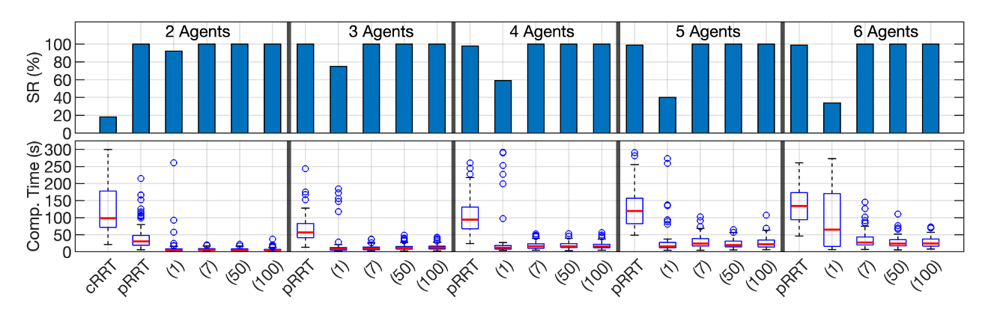
  <figcaption>Open Environment Results from [2]</figcaption>
</figure>

\
The authors' implementation of K-CBS implements something they call 'merging,' which is an important feature for tight environments where agents are very close togeather. The numbers labeling the columns of each of the plots from their figure above correspond to the 'merging constant,' where merging will often happen with a value of 1 and rarely happen with a value of 100. Therefore, our implementation is closest to theirs with a merging constant of 100. 

Note that our pRRT solver is not significantly outperformed by K-CBS, as K-CBS with a merge constant of 100 does against the pRRT implementation in the report. K-CBS does provide better quality solutions as compared to pRRT

#### Narrow Environment 

In the narrow environment agents must navigate a tight corridor between two fixed (not randomized) rectangular obstacles. Each agent's start and goal state is fixed (i.e. does not change iteration to iteration). As additional agents are added, additional hard-coded starts and goals are added as well. However, seeds are different for each run. 

<figure>
  <table style="width: 800px;">
  <tbody>
  <tr>
  <td style="width: 400px;">&nbsp;</td>
  <td style="width: 400px;">&nbsp;</td>
  </tr>
  </tbody>
  </table>
  <figcaption>PRRT solution to the 'narrow' environment with 3 agents. Agents 1 and 2 'kiss,' but do not 'collide!'</figcaption>
</figure>

\
We ran each of pRRT and K-CBS with an environment containing 3 agents. Success count, computation time, total cost among all agents, average path completion time among all agents, and max agent path time was recorded over every iteration. Each metric beyond success is only calculated on successful runs.

<table style="width: 800px;">
<tbody>
<tr>
<td style="width: 100px;">Success Rate (%)</td>
<td style="width: 700px;"></td>
</tr>
<tr>
<td style="width: 100px;">Computation Time (s)</td>
<td style="width: 700px;"></td>
</tr>
<tr>
<td style="width: 100px;">Cost</td>
<td style="width: 700px;"></td>
</tr>
<tr>
<td style="width: 100px;">Average Path Time (s)</td>
<td style="width: 700px;"></td>
</tr>
<tr>
<td style="width: 100px;">Maximum Path Time (s)</td>
<td style="width: 700px;"></td>
</tr>
</tbody>
</table>
PRRT in Blue, RRT K-CBS in Orange, and cRRT in Green. 

\
K-CBS was only successfull once.

Now, compare that to the table published in the original K-CBS paper:

<figure>
  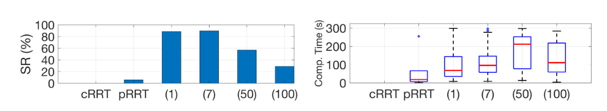
  <figcaption>Narrow Environment Results from [2]</figcaption>
</figure>

Remember that K-CBS with a merging constant of 100 _hardly_ ever, not _never_, merges. This could explain the poor results exhibeted by our K-CBS implementation. However, our pRRT still performs very well in comparison to theirs. 

#### Large Environment 

In the large environment agents with randomly-generated start positions and goals must navigate between 11 randomly-placed obstacles in a 33x33 unit environment.

<figure>
  <table style="width: 800px;">
  <tbody>
  <tr>
  <td style="width: 400px;">&nbsp;</td>
  <td style="width: 400px;">&nbsp;</td>
  </tr>
  </tbody>
  </table>
  <figcaption>PRRT solution to the 'large' environment with 10 agents.'</figcaption>
</figure>

\
We ran each of pRRT and K-CBS with environments containing 10, 15, and 20 agents. However, the authors did not report any data for pRRT, claiming it always timed out. Success count, computation time, total cost among all agents, average path completion time among all agents, and max agent path time was recorded over every iteration. Each metric beyond success is only calculated on successful runs.

<table style="width: 1000px;">
<tbody>
<tr>
<td style="width: 100px;"></td>
<td style="width: 300px;">10 Agents</td>
<td style="width: 300px;">15 Agents</td>
<td style="width: 300px;">20 Agents</td>
</tr>
<tr>
<td style="width: 100px;">Success Rate (%)</td>
<td style="width: 300px;"></td>
<td style="width: 300px;"></td>
<td style="width: 300px;"></td>
</tr>
<tr>
<td style="width: 100px;">Computation Time (s)</td>
<td style="width: 300px;"></td>
<td style="width: 300px;"></td>
<td style="width: 300px;"></td>
</tr>
<tr>
<td style="width: 100px;">Cost</td>
<td style="width: 300px;"></td>
<td style="width: 300px;"></td>
<td style="width: 300px;"></td>
</tr>
<tr>
<td style="width: 100px;">Average Path Time (s)</td>
<td style="width: 300px;"></td>
<td style="width: 300px;"></td>
<td style="width: 300px;"></td>
</tr>
<tr>
<td style="width: 100px;">Maximum Path Time (s)</td>
<td style="width: 300px;"></td>
<td style="width: 300px;"></td>
<td style="width: 300px;"></td>
</tr>
</tbody>
</table>
PRRT in Blue and RRT K-CBS in Orange 

\
The same results in table format, with the average of each metric beyond success listed with its Standard Error of the Mean. 
<table style="width: 1000px;">
<tbody>
<tr>
<td style="width: 100px;">10 Agents</td>
</tr>
<tr>
<td style="width: 100px;"></td>
<td style="width: 180px;">Success Rate (%)</td>
<td style="width: 180px;">Avg. Computation Time (s)</td>
<td style="width: 180px;">Avg. Cost</td>
<td style="width: 180px;">Avg. Average Agent Path Time (s)</td>
<td style="width: 180px;">Avg. Maximum Path Time</td>
</tr>
<tr>
<td style="width: 100px;">PRRT</td>
<td style="width: 180px;">78</td>
<td style="width: 180px;">17.249 &plusmn; 17.230</td>
<td style="width: 180px;">219.705 &plusmn; 4.901</td>
<td style="width: 180px;">43.739 &plusmn; 0.917</td>
<td style="width: 180px;">77.205 &plusmn; 2.636</td>
</tr>

<tr>
<td style="width: 100px;">RRT KCBS</td>
<td style="width: 180px;">100</td>
<td style="width: 180px;">11.570 &plusmn; 0.830</td>
<td style="width: 180px;">178.249 &plusmn; 4.007</td>
<td style="width: 180px;">38.771 &plusmn; 0.984</td>
<td style="width: 180px;">70.458 &plusmn; 2.040</td>
</tr>

<tr>
<td style="width: 100px;">15 Agents</td>
</tr>
<tr>
<td style="width: 100px;"></td>
<td style="width: 180px;">Success Rate (%)</td>
<td style="width: 180px;">Avg. Computation Time (s)</td>
<td style="width: 180px;">Avg. Cost</td>
<td style="width: 180px;">Avg. Average Agent Path Time (s)</td>
<td style="width: 180px;">Avg. Maximum Path Time</td>
</tr>
<tr>
<td style="width: 100px;">PRRT</td>
<td style="width: 180px;">58</td>
<td style="width: 180px;">28.296 &plusmn; 19.648</td>
<td style="width: 180px;">329.158 &plusmn; 8.117</td>
<td style="width: 180px;">43.494 &plusmn; 1.117</td>
<td style="width: 180px;">78.828 &plusmn; 2.614</td>
</tr>

<tr>
<td style="width: 100px;">RRT KCBS</td>
<td style="width: 180px;">98</td>
<td style="width: 180px;">45.371 &plusmn; 8.129</td>
<td style="width: 180px;">230.649 &plusmn; 4.246</td>
<td style="width: 180px;">38.279 &plusmn; 0.676</td>
<td style="width: 180px;">80.665 &plusmn; 2.197</td>
</tr>


<tr>
<td style="width: 100px;">20 Agents</td>
</tr>
<tr>
<td style="width: 100px;"></td>
<td style="width: 180px;">Success Rate (%)</td>
<td style="width: 180px;">Avg. Computation Time (s)</td>
<td style="width: 180px;">Avg. Cost</td>
<td style="width: 180px;">Avg. Average Agent Path Time (s)</td>
<td style="width: 180px;">Avg. Maximum Path Time</td>
</tr>
<tr>
<td style="width: 100px;">PRRT</td>
<td style="width: 180px;">40</td>
<td style="width: 180px;">35.631 &plusmn; 18.969</td>
<td style="width: 180px;">444.786 &plusmn; 10.849</td>
<td style="width: 180px;">44.299 &plusmn; 0.944</td>
<td style="width: 180px;">87.520 &plusmn; 2.849</td>
</tr>

<tr>
<td style="width: 100px;">RRT KCBS</td>
<td style="width: 180px;">88</td>
<td style="width: 180px;">101.702 &plusmn; 11.328</td>
<td style="width: 180px;">269.430 &plusmn; 4.492</td>
<td style="width: 180px;">37.419 &plusmn; 0.682</td>
<td style="width: 180px;">78.927 &plusmn; 2.045</td>
</tr>


</tbody>
</table>

\
Now, compare that to the table published in the original K-CBS paper:

<figure>
  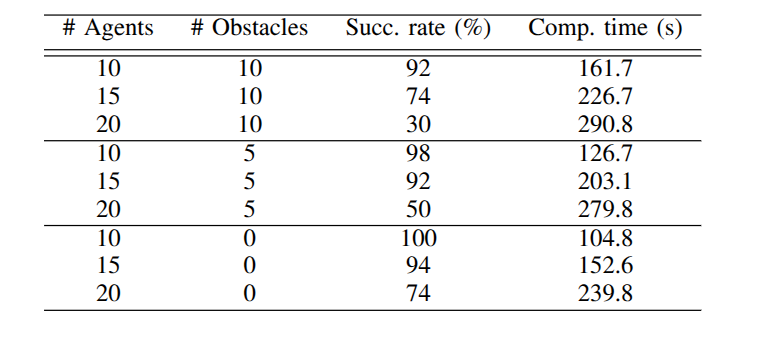
  <figcaption>Large Environment Results from [2]</figcaption>
</figure>

Far from never succeeding, in our runs pRRT was still successful a good portion of the time. K-CBS continued to provide higher-quality results than pRRT and on this environment was finally more successful. However, counter to expectations, pRRT was significantly faster as agent count increased (at least when it was successful at all).

While we used a random configuration (starts, goals, obstacles) for this environment, we do not believe that the authors of the original paper did (see [here](https://github.com/aria-systems-group/K-CBS-Demos/tree/511d0a815ac7676286d7f283a5d45b1d32686816/src)). We believe that this may be an oversight on their part, as the rigor of the solvers is more accurately tested when environments vary, especially those that are more than the most basic case (the open environment) or testing a special edge case (the narrow environment). 

#### Thoughts on the K-CBS Paper Experiment Recreation
The authors of the paper used a time limit to bound iterations--rather than an iteration count--on their experiments, which is tricky. Differences in framework (they used OMPL and C++ while we used python, which is often considered slower even with numba optimization), hardware (though for single threads, theirs was supposedly faster), and machine usage (the results reported here are from a server, which while more parallel hosts other experiments) can change the results significantly. Perhaps our code is better optimized, our machines faster, or our implementations are incorrect. However, a great portion of this summer was spent chasing the success percentages reported in this paper (expecting K-CBS to perform better and pRRT to comparatively perform worse). An optimization would be discovered, then we would modify all other methods and the test pipeline to work with these optimizations, then we would spend hours creating then pouring over profiling reports. At the end of the day, we may have been wasting our time attempting to achieve the performance we expected. We did reach out to the first author and his advisor for advice and implementation details beyond what we can find in their repositories, but they have been unresponsive. 

## General Thoughts and Future Work 

Overall, our results are trending in the right direction. Both K-CBS and cRRT are significantly improved in computation time and solution quality by edge bundles. 

However, the pRRT results from our edge bundle test need to be investigated. We are super surprised that--rather than being the only method that was consistently successful, as we had experienced all summer--edge bundles did not improve pRRT in this latest batch of experiments. We did change the size of the goal regions for this most recent round of tests and the effect of this change on the pRRT results need to be studied further. The method for resolving the 'tail error' should also be studied and alternate solutions considered. This needs to be understood before any other work is completed. 

The Mecanum agent we had been using has not been updated for numba. This needs to be be brought up to the current state of the code, and if not, another agent or two needs to be added to the pipeline runs. This will help us show that the improvement found by edge bundles is not limited to the Unicycle dynamics.  

We have not touched the PyBullet code since this summer and it is woefully out of date. The entire framework we used to implement it will need to be redesigned due to what can and cannot be called from numba-optimized functions. Once the PyBullet environment and agent is again functional, another agent should be added here as well. 

Merging should be added to K-CBS. Especially as we add more agents to the edge bundle tests--which we should do as well--this functionality could be extremely helpful for success rates. This has been on the docket for awhile but so far has not been completed. 

We plan on adding an agent in belief space. We should be able to generate edge bundles for this agent and run it through the pipeline as we are running the unicycle agent. If edge bundles improve planning performance for this agent as well it would help increase the significance of our result. 

We also plan to implement SST as an additional base planner. Like the belief space agent, this could make our results stand out more in a conference submission. 

'Type 1' edge bundles from [^2] need to be explored. While we have heard some uncomplimentary things about the quality of the results shown there, they could lead to an interesting result. More importantly, they could allow us to plan for end effectors, which our 'type 2' edge bundles cannot support. 

Finally, if we are so inclined, cRRT could be updated to support second-order dynamics in order to compare against the results from the original K-CBS paper. 

# Setup and Execution

1. Clone repo and init submodules 
```
$ git clone --recurse-submodules git@github.com:himanshugupta1009/mrmp_with_kite_extend.git
```
2. Install required packages:
```
$ python -m pip install -r requirements.txt
```

And you should be all set!

_Note: If you are having issues about missing packages in the submodules, try changing the following:_
- Change lines 22-25 in pybullet-planning/motion/motion_planners/utils.py to: 
```python
# try:
#    user_input = raw_input
# except NameError:
user_input = input
```
- Change lines 44-49 in pybullet-planning/pybullet_tools/utils.py to:
```python
# from future_builtins import map, filter
# from builtins import input # TODO - use future
# try:
#     user_input = raw_input
# except NameError:
user_input = input 
```

## Example Code:
### Edge Bundle RRT KCBS with Unicycle Agents:
_(From playing_with_printing.ipynb)_

```python
from mapf_env_square_agent_unicycle import *
from Environments import *

goal_radius = 1.0

# create goals 
obstacles = [
            CircularObstacle2D(10, 10, 2),
            CircularObstacle2D(16, 25, 3),
            CircularObstacle2D(20, 5, 2),
            CircularObstacle2D(35, 15, 2),
            CircularObstacle2D(30, 34, 4),
            CircularObstacle2D(25, 15, 4),
            CircularObstacle2D(7, 19, 4),
            CircularObstacle2D(16, 16, 2),
            CircularObstacle2D(33, 4, 2),
            CircularObstacle2D(8, 34, 3),
            CircularObstacle2D(20, 32, 2),
            CircularObstacle2D(31, 24, 3),
            ]                      
env = SquareEnvironment(40, 40, obstacles)

num_agents = 5

start1 = (7.0, 5.0, 0)
goal1 = (24.0, 37.0)

start2 = (2.0, 26.0, 0)
goal2 = (37.0, 30.0)

start3 = (28.0, 5.0, 0)
goal3 = (5.0, 29.0)

start4 = (32.0, 18.0, 0)
goal4 = (2.0, 10.0)

start5 = (16.0, 37.0, 0)
goal5 = (36.0, 10.0)

starts = [start1, start2, start3, start4, start5]
goals = [goal1, goal2, goal3, goal4, goal5]

agent_ids = []
agents = []
for agent_id in range(num_agents):
    agent_ids.append(agent_id)
    agents.append(get_unicycle_agent(agent_id))

planners = []
planner_function = get_eb_rrt_planner
for i in range(num_agents):
    planners.append(planner_function(starts[i],goals[i],goal_radius,agents[i],env, edge_bundle_file_location='../edge_bundles/eb_unicycle_edges_100000.npz'))

s = 42  
kcbs_planner = KCBS(
                    env = env,
                    agents = agents,
                    low_level_planners = planners,
                    max_trials = 50,
                    planning_time = 600.0,
                    rng_seed = s,
                    print_logs=True,
                    debug_flag=True
                    )
path_found, paths, cost, delta_t = kcbs_planner.plan_multi_agent_paths()
```


### Edge Bundle PRRT with Turtle Agents (NOT CURRENTLY FUNCTIONING):
_(From playing_with_pybullet.ipynb)_

```python
from Environments import *
from pybullet_env import PyBulletTurtle, PyBulletEnv, CircleObsPybullet
from edge_bundle_rrt import EdgeBundleRRT

import numpy as np
import math

# load an edge bundle 
from edge_bundle import EdgeBundle
# Must pick an edge bundle that matches the parameters of the agent you plan to use
edge_bundle_file_location = '../edge_bundles/eb_pb_turtle_speed_10_edges-10000.npz' 
data = np.load(edge_bundle_file_location, allow_pickle=True)
eb_pbt = EdgeBundle(data, fix_num_edges=1000)

goal = (16.5, 5.0, math.pi, 0.0)
start = ((7.0, 1.0, 0.1), (0, 0, 0, 1.0))
goal_radius = 1.0
obstacles = [CircleObsPybullet(5, 5, 1),
            CircleObsPybullet(9, 8, 1.5),
            CircleObsPybullet(10, 2.5, 1.5)
            ] 
                    
env = PyBulletEnv(20, 20, obstacles, use_gui=True, speed=30)
agent = PyBulletTurtle(10, agent_id=1)
env.add_agent(agent, goal=(goal, goal_radius))

print("Creating RRT")
rrt  = EdgeBundleRRT( start=start, goal=goal, goal_radius=goal_radius, 
           env = env, agent=agent, edge_bundle=eb_pbt,
           max_iter = 5000, planning_time=math.inf,         
           isvalid_function=PyBulletTurtle.is_new_node_valid, cost_function=PyBulletTurtle.get_cost,
           random_point_function=PyBulletTurtle.get_random_point, 
           reached_goal_function = PyBulletTurtle.agent_reached_goal,
           translate_function=PyBulletTurtle.point_translate_function,
           udf_seed = 77,
           print_logs=False
           )
print("Planning RRT")
rrt.plan_path()
path_ids, path_states, controls, timesteps = rrt.get_path()
pybullet_utils.disconnect()

```
Screenshot:  
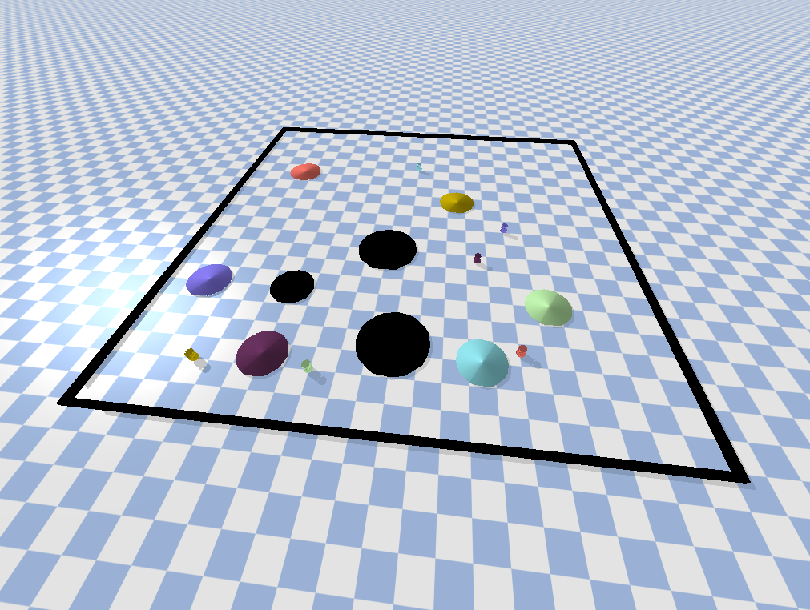


### Quick Navigator:
* [edge_bundles/](./edge_bundles)
  * This folder contains utilities for generating edge bundles for various agents as well as a few example edge bundles.

  * [mecanum_edge_generation.py](./edge_bundles/mecanum_edge_generation.py)
    * Generates an edge bundle for a mecanum agent
  * [pybullet_turtle_eb_gen.py](./edge_bundles/pybullet_turtle_eb_gen.py)
    * generates edge bundles for a TurtleBot agent used in PyBullet sims 
  * [unicycle_edge_generation.py](./edge_bundles/unicycle_edge_generation.py)
    * Generates an edge bundle for a unicycle agent
* [media/](./media)
  * Various images and GIFs generated from our simulations 
* [pipeline_code/](./pipeline_code)
  * Files here are used to run test pipelines.
  * [agent_builders.py](./pipeline_code/agent_builders.py)
    * Defines various agents in a consistent format for use in test pipelines.
  * [test_classes.py](./pipeline_code/test_classes.py)
    * Provide ways to run various planners in a consistent format for the pipelines.
  * [test_pipeline_kcbs_paper_33x33.py](./pipeline_code/test_pipeline_kcbs_paper_33x33.py)
    * Defines the environment and runs tests for the 15x15 and 30x30 environments from the K-CBS paper[^2], with and without obstacles.
  * [test_pipeline_corridor.py](./pipeline_code/test_pipeline_corridor.py)
    * Defines the environment and runs tests for the 'narrow' environment from the K-CBS paper[^2].
  * [test_pipeline_open.py](./pipeline_code/test_pipeline_open.py)
    * Defines the environment and runs tests for the 'open' environment from the K-CBS paper[^2].
  * [test_pipeline_pybullet.py](./pipeline_code/test_pipeline_pybullet.py)
    * An expandable framework to run 'mathematical' sims through randomized environments for benchmarking. Currently will not function.
  * [test_pipeline_random.py](./pipeline_code/test_pipeline_random.py)
    * An expandable framework to run 'mathematical' sims through randomized environments for benchmarking edge bundle planning methods alongside their non-edge bundle counterparts. 
* [pybullet-planning/](./pybullet-planning)
  * A submodule from Dr. Correll's lab to help with PyBullet sims. 
* [sandbox/](./sandbox)
  * A good place to get started. playing_with_printing demonstrates most functionality for using and rendering 'mathematical' simulations while playing_with_pybullet demonstrates the same for PyBullet simulations. 
  * [playing_with_printing.ipynb](./sandbox/playing_with_printing.ipynb)
  * [playing_with_pybullet.ipynb](./sandbox/playing_with_pybullet.ipynb) 
    * Currently not working!
* [src/](./src)
  * [Agents.py](./src/Agents.py)
    * Various 'mathematical' agents
  * [Environments.py](./src/Environments.py)
    * An environment and obstacles for 'mathematical' sims
  * [cRRT.py](./src/cRRT.py)
    * Centralized-RRT (cRRT) Planner 
  * [cRRT_eb.py](./src/cRRT_eb.py)
    * Centralized-RRT (cRRT) Planner using 'type 2' edge bundles.
  * [constrainedX.py](./src/constrainedX.py)
    * 'Constrained' RRT planners that plan around limitations or 'constraints' on where an agent can be at a certain time. Used for K-CBS
  * [edge_bundle.py](./src/edge_bundle.py)
    * The handling class for edge bundles. Use this class to read in an .npz edge bundle for use (see the edge bundle planner examples in the sandbox notebooks)
  * [edge_bundle_rrt.py](./src/edge_bundle_rrt.py)
    * RRT that leverages edge bundles to streamline pathfinding. Currently only supporting 'type 2' edge bundles, though 'type 1' edge bundles[^3] may be supported later. 
  * [edge_bundle_rrt_animator.py](./src/edge_bundle_rrt_animator.py)
    * A child class of EdgeBundleRRT that provides an interactive display of the planning process, useful for debugging new edge bundle implementations 
  * [env_square_agent_dubins.py](./src/env_square_agent_dubins.py)
    * Utility functions for a dubins car agent
  * [env_square_agent_unicycle.py](./src/env_square_agent_unicycle.py)
    * Utility functions for a Unicycle agent
  * [kcbs.py](./src/kcbs.py)
    * the main K-CBS planner class
  * [mapf_env_square_agent_unicycle.py](./src/mapf_env_square_agent_unicycle.py)
    * Utility functions for a Unicycle agent in a multi-agent-pathfinding scenario
  * [printer.py](./src/printer.py)
    * Utilities for rendering 'mathematical' simulations
  * [prrt.py](./src/prrt.py)
    * Priority-RRT (pRRT) implementation
  * [prrt_eb.py](./src/prrt_eb.py)
    * Priority-RRT (pRRT) implementation using 'type 2' edge bundles.
  * [pybullet_env.py](./src/pybullet_env.py)
    * An environment, agent, and obstacles for PyBullet MAPF simulations
  * [rrt.py](./src/rrt.py)
    * The base RRT class
  * [rrt_animator.py](./src/rrt_animator.py)
    * A child class of RRT that provides an interactive display of the planning process, useful for debugging new agents and techniques  
  * [utils.py](./src/utils.py)
    * Odds and ends of convenience, including many methods that can be precompiled for performance benefits. 
* [test_results/](./test_results/)
  * Text reports and images from pipeline runs. 
* [requirements.txt](./requirements.txt)
  * Have you installed these?